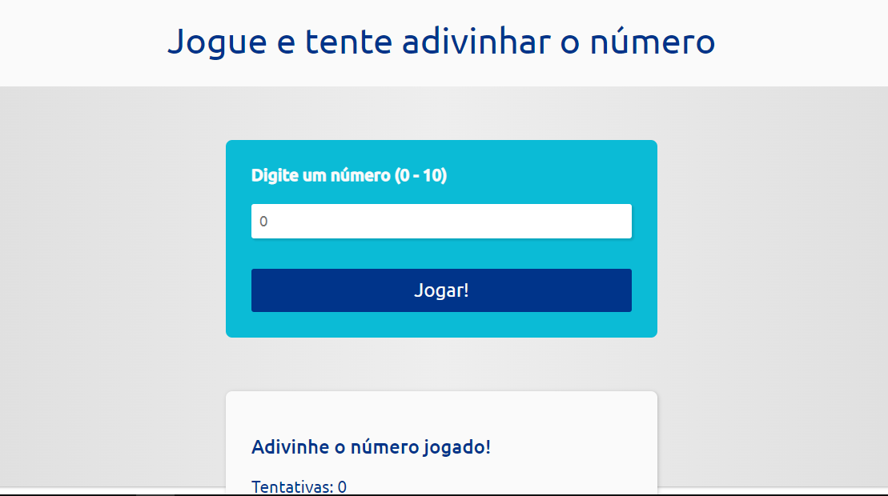
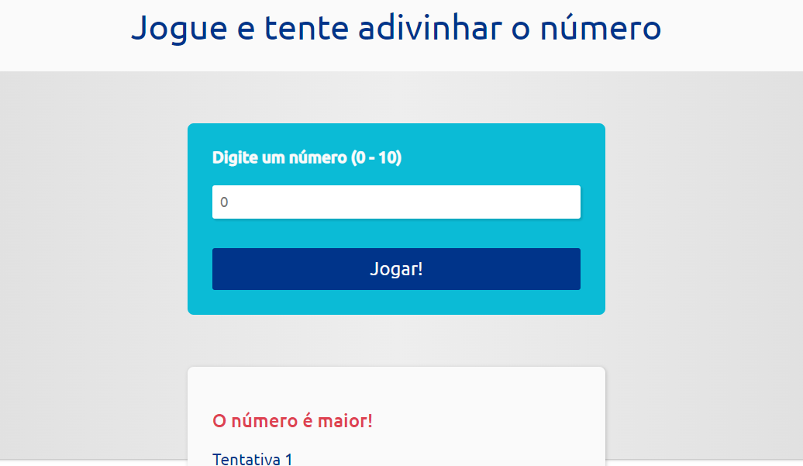
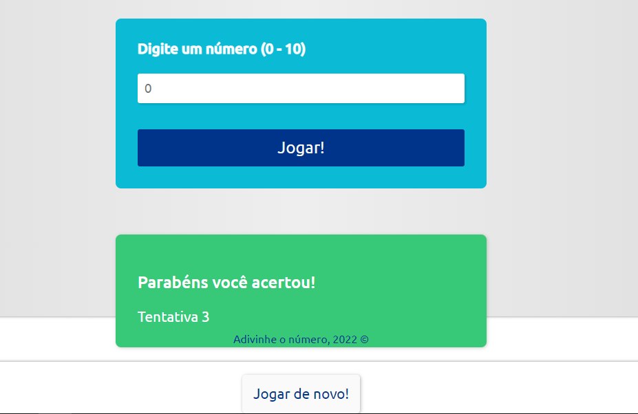

Um mini-game onde o usuário deve adivinhar o número sorteado pelo computador. Se o usuário digita um valor menor que 10, se não acertar o número, o computador informa que o número é maior para assim o usuário tentar acertar o número. Isso é válido no vice-versa também, ou seja, se o usuário digitar um número maior que 0, se não acertar o número, o computador informa que o número é menor, até o usuário acertar o número e vencer o mini-game.

Tecnologias utilizadas: HTML5, CSS3 e JavaScript.

